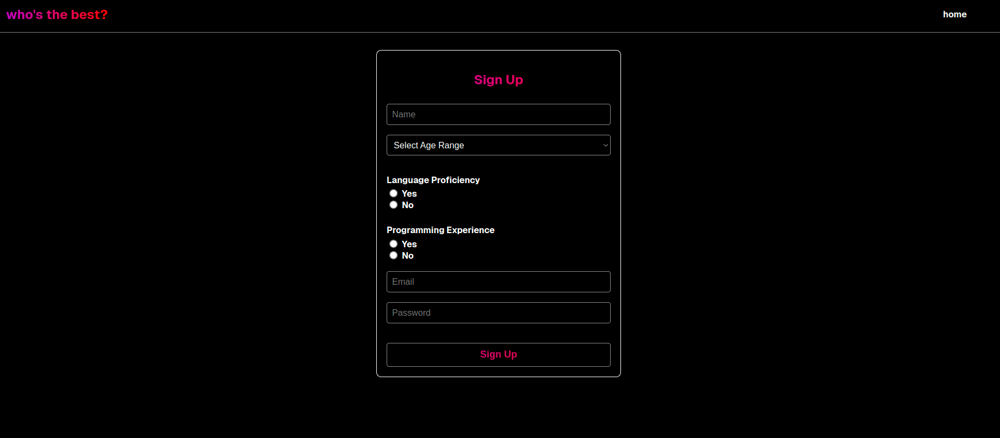

# Project Overview

This project is a web application designed to test and analyze user performance in identifying text formats like **camelCase** and **kebab-case**. It evaluates users' speed and accuracy in distinguishing between these two text styles and collects data to explore how different text formats influence readability and interaction.

---

## How It Works

### **1. User Registration and Login**
- Users sign up through a form providing basic details like:
  - Name
  - Email
  - Password
  - Age group
  - Programming experience
- The backend securely stores this data using a MongoDB database.
- Registered users log in to access the testing platform, with credentials validated by the backend API.




### **2. Test Mechanics**
- Upon successful login, users are presented with a series of phrases.
- For each phrase, users must select the correct format (**camelCase** or **kebab-case**) from multiple options displayed on interactive cards.
- The test tracks:
  - **Response Time**: Time taken to select an answer.
  - **Correctness**: Whether the selected answer matches the expected format.


### **3. Data Collection and Analysis**
- Users' selections, correctness, and response times are recorded.
- Data is sent to the backend for storage and processing.
- At the end of the test:
  - Users are shown their **total time**, a breakdown by text format, and thanked.
  - They are automatically redirected after viewing results.


### **4. User Flow**
- The application uses **React Router** to guide users through key pages:
  - Introduction
  - Signup
  - Login
  - Test Interface
- Protected routes ensure only authenticated users can access the test.


---
---

## Technology Stack

### **Frontend**
- **React**: User interface and routing.
- **CSS**: Styling for components.
- **React Toastify**: For notifications (e.g., success, error messages).
- **Axios**: For API communication.

### **Backend**
- **Express.js**: API server and routing.
- **MongoDB**: For database operations.
- **Mongoose**: For schema definition and interaction with the database.

### **API Endpoints**
- **Signup**: Registers new users.
- **Login**: Authenticates existing users.
- **Submit Answers**: Records test results.

---

## Purpose of the Project

This project is a comprehensive tool for:
- Collecting data on how users interact with different text formats.
- Analyzing response times and accuracy for **camelCase** and **kebab-case** formats.
- Providing insights into the impact of text styles on readability and usability.


Follow the instructions below to set up and run the project.

# Client Setup (Frontend)

1. Create a `.env` File

Inside the `client` folder, create a `.env` file and include the following fields (comment the second one if run locally):

```env

REACT_APP_API_BASE_URL=http://localhost:5000  // to run it locally if the project is offline

REACT_APP_API_BASE_URL=https://ee-assignment-2.onrender.com  // if the project is online

```

2. Install Dependencies

Open a terminal, navigate to the `client` folder, and run:

```bash

npm install

```

3. Run the Frontend

Start the React development server by running:

```bash

npm start

```

The frontend will be accessible at `http://localhost:3000`.


# Server Setup (Backend)

1. Create a `.env` File

Inside the `server` folder, create a `.env` file and include the following fields:

```env

MONGO_URI=mongodb+srv://<username>:<password>@experiment.imnwh.mongodb.net/register

PORT=5000

```

- Replace `<username>` and `<password>` with your MongoDB Atlas credentials.

2. MongoDB Setup

No special setup is required for the database itself.

- Ensure the database named `register` exists in your MongoDB instance(specified in the mongoURI above /register).
- Inside the `register` database, create the following collections:
- `users`
- `answers`

3. Install Dependencies

Open a terminal, navigate to the `server` folder, and run:

```bash

npm install

```

4. Run the Backend

Start the backend server by running:

```bash

npm start

```

The backend server will run on `http://localhost:5000`.

---

